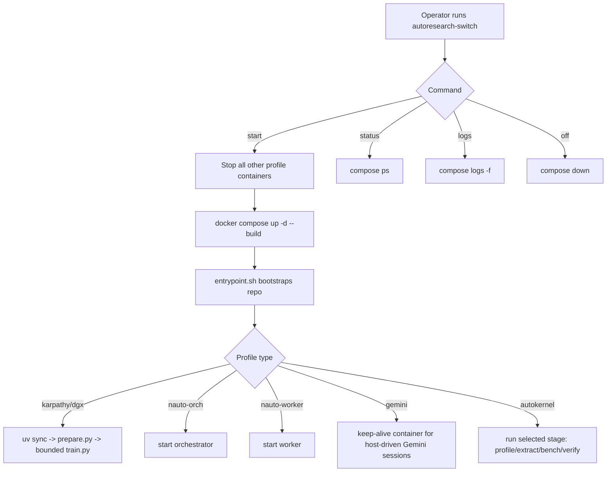

# Autoresearch Containers

Launcher-oriented Docker runtime for upstream autoresearch projects, without code folding.

## What This Is

This folder provides:
- a common CUDA+Python+uv container base
- a compose file with one profile per upstream project
- `autoresearch-switch` to enforce mutually exclusive runtime
- smoke tests and runbooks

This stack **does not merge upstream codebases**. It clones/fetches each upstream repo into `upstreams/` and runs each in isolation.

## Source Attribution (Where Each Part Came From)

### Upstream projects
- `karpathy/autoresearch`:
  - baseline autoresearch training/research loop design
- `David-Barnes-Data-Imaginations/autoresearch-DGX-Spark`:
  - DGX Spark adaptation pattern and host-targeted workflow direction
- `iii-experimental/n-autoresearch`:
  - orchestrator/worker split for parallel autonomous research behavior
- `supratikpm/gemini-autoresearch`:
  - Gemini-oriented autonomous research workflow and skill framing
- `RightNow-AI/autokernel`:
  - kernel optimization pipeline shape (`profile`/`extract`/`bench`/`verify`)

### Community references consulted
- NVIDIA forum discussions around Spark customizations and runtime constraints
- community writeups/tutorials on autoresearch usage and multi-agent variants

### Local patterns reused from this repo
- `docker/docker-llm-switch` influenced the switch UX (`start/off/status/logs`, one active workload at a time)
- existing Docker smoke-test style influenced `docker/autoresearch/SMOKE-TESTS.md`

## Layout

- `Dockerfile.base` - shared base image
- `docker-compose.autoresearch.yml` - profile service definitions
- `scripts/autoresearch-switch` - operator CLI
- `scripts/entrypoint.sh` - profile bootstrap + dispatch
- `SMOKE-TESTS.md` - validation checklist

## Profiles

- `karpathy`
- `dgx`
- `nauto-orch`
- `nauto-worker`
- `gemini`
- `autokernel`

## Runtime Graph



## Quickstart

1. Bootstrap folders:
```bash
./docker/autoresearch/scripts/autoresearch-switch bootstrap
```

2. Configure `.env.autoresearch` (repo URLs, memory caps, optional args).

3. Start a profile:
```bash
./docker/autoresearch/scripts/autoresearch-switch start karpathy
```

4. Check status/logs:
```bash
./docker/autoresearch/scripts/autoresearch-switch status
./docker/autoresearch/scripts/autoresearch-switch logs karpathy
```

5. Switch profiles safely (mutual exclusion enforced):
```bash
./docker/autoresearch/scripts/autoresearch-switch start dgx
```

6. Stop all:
```bash
./docker/autoresearch/scripts/autoresearch-switch off
```

## Mount and Data Contract

- `upstreams/` -> `/workspace/upstreams` (cloned upstream repos)
- `runs/` -> `/workspace/runs` (logs/artifacts)
- `work/` -> `/workspace/work` (scratch)
- `secrets/` -> `/secrets` (readonly credentials/config)

## Operational Notes

- One profile runs at a time by design to avoid resource contention.
- Containers use host networking and GPU pass-through.
- Tune memory in `.env.autoresearch` per profile based on observed OOM/throughput.
- For validation steps, use `SMOKE-TESTS.md`.
